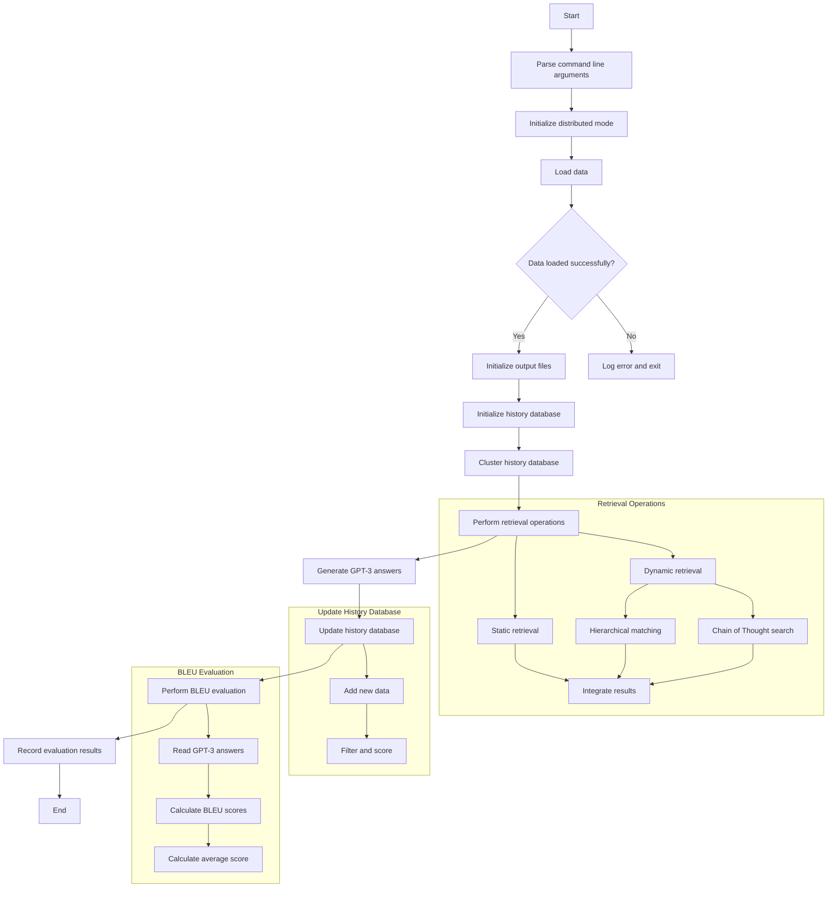

# DH-RAG
DH-RAG is a baseline dialogue system based on Retrieval-Augmented Generation (RAG).

## System Flow


## Running Environment
1. Enable docker environment:
   ```
   docker run --gpus all -it -v /home/feiyuan/glusterfs/DH-RAG:/home/dh-rag feiyuan_self_rag_0506 /bin/bash
   ```
2. Enable conda environment:
   ```
   cs
   ```
3. Enter execution directory:
   ```
   cd /home/dh-rag/scripts
   ```

## Running Instructions
Run baseline script:
```
python run_mobilecs2_baseline_zfy_0811.py \
    --model_name_or_path facebook/contriever-msmarco \
    --passages ../data/mobilecs2_data/transformed_data.jsonl \
    --passages_embeddings "../data/mobilecs2_data/embedding_data/passages_00" \
    --data ../data/mobilecs2_data/valid_data_zfy/valid_conversations.json  \
    --output_dir ./output_data/mobilecs2_data/ \
    --n_docs 5
```

## File Description
- `INPUT_DATA_FILE`: Input data file, containing original queries and conversation history.
- `OUTPUT_DATA_FILE`: Output data file, used to store final processing results.
- `RETRIEVAL_RESULTS_FILE`: Stores retrieval system results.
- `HISTORY_MATCH_OUTPUT_FILE`: Stores history matching results.
- `HISTORICAL_DATABASE_FILE`: Historical database file, stores processed queries and answers.
- `CLUSTERED_DATABASE_FILE`: Stores the clustered historical database.
- `CHAIN_OF_THOUGHT_RESULTS_FILE`: Stores results from "Chain of Thought" searches.
- `INTEGRATED_RESULTS_FILE`: Stores integrated retrieval results.
- `GPT3_ANSWERS_FILE`: Stores answers generated by GPT-3.5-turbo.

## Future Module Breakdown Plan
- `main.py`: Main script, program entry point.
- `config.py`: Configuration class, manages all configuration parameters.
- `data_loader.py`: Data loading and processing.
- `retriever.py`: Information retrieval.
- `answer_generator.py`: GPT-3.5-turbo answer generation.
- `evaluator.py`: BLEU score evaluation.
- `historical_database.py`: Historical data management and updates.
- `utils.py`: General utility functions.
```
