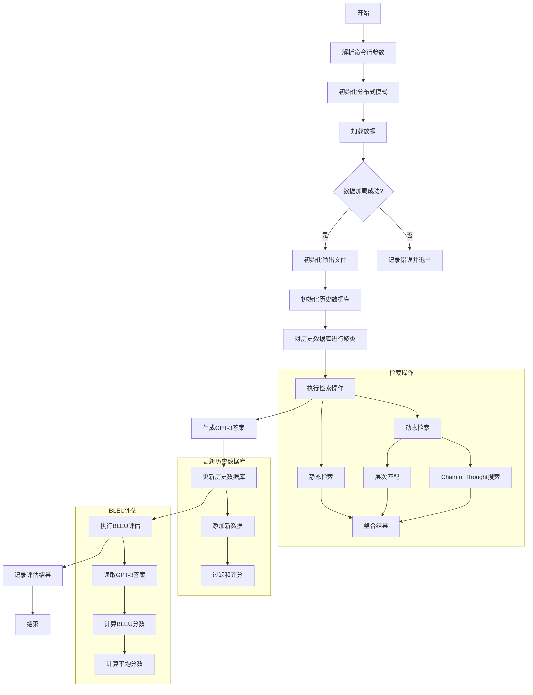

# DH-RAG

DH-RAG是一个基于检索增强生成(RAG)的对话系统基线。

## 系统流程



## 运行环境

1. 启用docker环境:
   ```
   docker run --gpus all -it -v /home/feiyuan/glusterfs/DH-RAG:/home/dh-rag feiyuan_self_rag_0506 /bin/bash
   ```

2. 启用conda环境:
   ```
   cs
   ```

3. 进入执行目录:
   ```
   cd /home/dh-rag/scripts
   ```

## 运行指令

运行baseline脚本:

```
python run_mobilecs2_baseline_zfy_0811.py \
    --model_name_or_path facebook/contriever-msmarco \
    --passages ../data/mobilecs2_data/transformed_data.jsonl \
    --passages_embeddings "../data/mobilecs2_data/embedding_data/passages_00" \
    --data ../data/mobilecs2_data/valid_data_zfy/valid_conversations.json  \
    --output_dir ./output_data/mobilecs2_data/ \
    --n_docs 5
```

## 文件说明

- `INPUT_DATA_FILE`: 输入数据文件,包含原始查询和对话历史。
- `OUTPUT_DATA_FILE`: 输出数据文件,用于存储最终处理结果。
- `RETRIEVAL_RESULTS_FILE`: 存储检索系统的结果。
- `HISTORY_MATCH_OUTPUT_FILE`: 存储历史匹配的结果。
- `HISTORICAL_DATABASE_FILE`: 历史数据库文件,存储处理过的查询和答案。
- `CLUSTERED_DATABASE_FILE`: 存储聚类处理后的历史数据库。
- `CHAIN_OF_THOUGHT_RESULTS_FILE`: 存储"思维链"搜索的结果。
- `INTEGRATED_RESULTS_FILE`: 存储整合后的检索结果。
- `GPT3_ANSWERS_FILE`: 存储GPT-3.5-turbo生成的答案。

## 未来模块拆分计划

- `main.py`: 主脚本,程序入口点。
- `config.py`: 配置类,管理所有配置参数。
- `data_loader.py`: 数据加载和处理。
- `retriever.py`: 信息检索。
- `answer_generator.py`: GPT-3.5-turbo答案生成。
- `evaluator.py`: BLEU评分评估。
- `historical_database.py`: 历史数据管理和更新。
- `utils.py`: 通用工具函数。